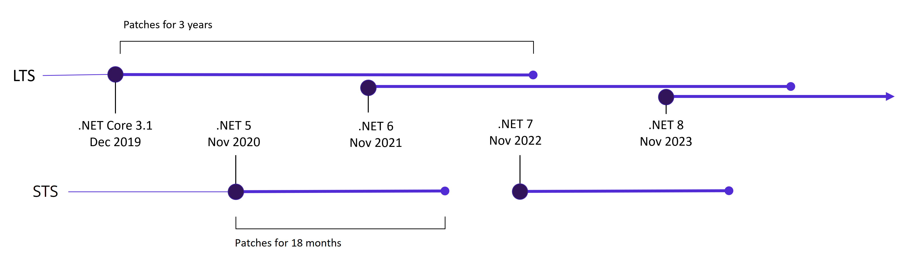
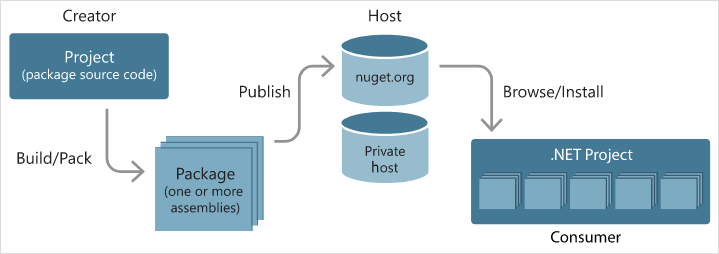

# C# and .NET part 1

<div class="lectors">
    <hr/>
    Patrik Švikruha
    <br/>
    Samuel Janek
</div>

---

# Introduction to .NET

---

<!-- Style is applied to all slides bellow -->
<!-- backgroundImage: url(../images/default-bg-with-logo.png) -->

## What is .NET?

- Free, **cross-platform**, **open source** developer platform
- Runtime - has its own language (CIL)
- Maintained by Microsoft
- Created because of [litigation](https://www.cnet.com/tech/tech-industry/sun-microsoft-settle-java-suit/) about Java “tweaking” on Windows

---

## Why to choose .NET?

- Productivity
- Almost every platform
- Performance
- Security
- Open Source
- Large ecosystem

---

### Productivity

- To develop high quality applications faster
- Modern language constructs
    - Generics
    - Language Integrated Query (LINQ)
    - Asynchronous programming
- Extensive class libraries - NuGet
- Common APIs
- Multi-language support
- Awesome IDEs: [Visual Studio](https://visualstudio.microsoft.com/), [Rider](https://www.jetbrains.com/rider/)

---

### Almost every platform

<!-- _backgroundImage: none -->


---

### Performance

- It's really **fast** 🚀
- 7 million plaintext responses per second
- [Benchmarks](https://www.techempower.com/benchmarks/#section=data-r21&hw=ph&test=plaintext)

---

### Security

- **Managed runtime** ~ _Sandbox_
    - No direct memory access
    - Prevents critical issues like buffer overflow, index out of range etc.
- Patches are released with runtime

---

### Open Source

- [.NET Core](https://github.com/dotnet/core)
- [.NET Runtime/CoreFX](https://github.com/dotnet/runtime)
- [ASP.NET Core](https://github.com/dotnet/aspnetcore)
- [.NET Standard](https://github.com/dotnet/standard)
- [EF Core](https://github.com/dotnet/efcore)
- [WPF](https://github.com/dotnet/wpf)
- [Reference Source - .NET Framework (readonly)](https://github.com/microsoft/referencesource)

---

### Large ecosystem

- Libraries from the **NuGet package manager**
- Frameworks: .NET MAUI, Blazor, ASP.NET Core, Dapper, EF Core
- Visual Studio marketplace
- Extensive partners network
- Large community
- Community support, MVPs, ...

---

#### .NET Foundation

- Non-profit organization that maintains .NET ecosystem
    - Licence agnostic (all projects under .NET Foundation are OSS)
    - Languages, tooling, frameworks...
    - Following of ECMA [334](https://www.ecma-international.org/publications-and-standards/standards/ecma-334/) and [335](https://www.ecma-international.org/publications-and-standards/standards/ecma-335/) standards
- Independent from Microsoft

---

## .NET implementations (runtimes)

- **.NET 5 and later versions** (current version is **.NET 7**)
    - Successor of .NET Core and Mono
    - The bright future of .NET 👏
- .NET Core
    - Cross-platform successor of .NET Framework
- .NET Framework
    - Original implementation of .NET
    - Windows OS only
- Mono/Xamarin
- UWP

---

## .NET Standard

- Formal specification of .NET APIs that are available on multiple .NET implementations
- **Enables code sharing between different implementations**
- No new versions of .NET Standard will be released
- Recommended version to use is **.NET Standard 2.0**
- **Enables migration from .NET Framework**
- Evolution of Portable Class libraries (PCL)

---

<!-- _backgroundImage: none -->


---

## .NET Schedule

**STS** = Short Term Support
**LTS** = Long Term Support - min. 3 years



---

<!-- _backgroundImage: none -->


## .NET internals

- CLI
- CTS
- CIL
- CLR
- BCL
- GC

---

<!-- backgroundImage: url(../images/default-bg-with-logo.png) -->

### Common Language Infrastructure (CLI)

- Standard
    - [ISO/IES 23271:2012](https://www.iso.org/standard/58046.html)
    - [ECMA-335](https://www.ecma-international.org/publications-and-standards/standards/ecma-335/)
- Design of platform is OS agnostic
- Related stuff:
    - Common Langauge Specification (CLS)
    - Common Type System (CTS)
    - Common Language Runtime (CLR)
    - Common Intermediate Language (CIL)
    - Standard libraries

---

### Common Type System (CTS)

- Defines how types are declared, used, and managed in the CLR
- Defines rules that languages must follow, to be able to interact with each other
- Provides a library that contains the primitive data types
- Supports the following five categories of types:
    - **Classes**
    - **Structures**
    - **Enumerations**
    - **Interfaces**
    - **Delegates**

---

### Common Intermediate Language (CIL)

- More names:
    - Microsoft Intermediate Language
    - Intermediate Language
- Language of a virtual execution environment (CLR)
- Set of platform independent instructions

---

### Common Language Runtime (CLR)

- Essential runtime services
- _Common_ because it can be shared by different _managed_ programming languages
- Converts the **IL** into the **native code** of the machine
- **Just-in-Time** vs **Ahead-of-Time** compilation
- Benefits:
    - Performance improvements - _JIT_
    - Garbage Collection - memory management
    - Structured _exception handling_
    - _Delegates_ instead of function pointers

---

### Base Class Library (BCL)

- Predefined set of libraries with core functionality for programmers
- Expected with any .NET implementation
- [Source code of the BCL](https://github.com/dotnet/runtime)

---

### Garbage Collector (GC)

- Automatic memory management
- Managed heap
- Garbage collection occurs when one of the following conditions is true:
    - The system has low physical memory
    - An acceptable threshold on managed heap is reached
    - `GC.Collect` method is called - **DO NOT DO THIS**
- **GC does not collect on unmanaged resources!**

---

### How does it all work together


---

## .NET tools - CLI

- Cross-platform toolchain for developing, building, running and publishing
- Part of .NET SDK
- Invokes `dotnet` driver - resposible for app or command execution

    ```bash
    dotnet --version    # Get current SDK version
    dotnet --list-sdks  # Lists all installed SDKs
    dotnet new          # Creates a new project, configuration file, or solution
    dotnet restore      # Restores the dependencies and tools of a project
    dotnet build        # Builds a project and all of its dependencies
    dotnet publish      # Publishes the app and its dependencies to a folder for deployment
    dotnet run          # Runs source code
    dotnet test         # Run available unit tests
    dotnet pack         # Packs the code into a NuGet package
    dotnet clean        # Cleans the output of a project
    dotnet sln          # Lists or modifies the projects in a .NET solution file
    dotnet format       # Formats code to match editorconfig settings
    ```

---

## .NET tools - NuGet

- Package manager for .NET platform
- Nuget package
    - Shareable unit of code
    - `.nupkg` file with DLLs and assets
- Responsible for managing dependency tree in projects
- .NET Standard vs Multi-targeting
- [nuget.org](https://www.nuget.org/)

---

<!-- backgroundImage: none -->



---

<!-- backgroundImage: none -->

# Introduction to C#

---

## What is C#?

- **General-purpose, multi-paradigm, type-safe programming language**
- Created for .NET platform
- Defined by [ECMA-334](https://www.ecma-international.org/publications-and-standards/standards/ecma-334/)
- Syntax is based on C language family
- **Current version is C# 11**
- Designers: Anders Hejlsberg, Mads Torgersen
- _Microsoft Java_

---

## HelloWorld project

- Create new project:
`dotnet new console -n HelloWorld --use-program-main`

- Examine project structure:
`Program.cs`
`HelloWorld.csproj`

---

### HelloWorld project - `Program.cs`

```csharp
namespace HelloWorld;

class Program
{
    static void Main(string[] args)
    {
        Console.WriteLine("Hello, World!");
    }
}
```

---

### HelloWorld project - `HelloWorld.csproj`

```xml
<Project Sdk="Microsoft.NET.Sdk">

  <PropertyGroup>
    <OutputType>Exe</OutputType>
    <TargetFramework>net7.0</TargetFramework>
    <ImplicitUsings>enable</ImplicitUsings>
    <Nullable>enable</Nullable>
  </PropertyGroup>

</Project>

```

---

## Syntax

- **Identifiers**
    - Names that programmers choose for entities (variables, methods...)

        ```csharp
        var identifierOfVariable = "value of variable";
        ```

- **Keywords**
    - Names that mean something special to the compiler
    - Can be used as identifier with prefix `@`
    - [List of keywords](https://learn.microsoft.com/en-us/dotnet/csharp/language-reference/keywords/)

        ```csharp
        int class = 10;     // Illegal
        int @class = 10;    // Legal but ugly
        ```
---

## Syntax

- **Delimiters**
    - Characters used to structure the code
    - **Curly braces** `{}`
        - Creates code blocks
        - Used to impart a scope
    - **Semicolon** `;`
        - Delimits a statement
        - C# allows to write statements on more lines

            ```csharp
            Console.WriteLine
                (1 + 2 + 3 + 4);
            ```
---

## Syntax

- **Literals**
    - Primitive pieces of data lexically embedded into the program
    - Data inserted in a code

        ```csharp
        var integralConstant = 42;
        var helloWorldString = "Hello World";
        var pi = 3.14;
        ```
---

## Comments

**Single-line comment**
```csharp
// line comment
```

**Multiline comment - DO NOT USE**
```csharp
/* I am
   multiline comment */
```

**Documentation**
```csharp
/// <summary>
/// This is my awesome docs for some class/method/property...
/// </summary>
```
---

## Data types

- Instruct compiler or interpreter how the programmer intends to use data
- **Value types**
    - Variable directly **contains data**
    - Each variable has its own copy of the data!
- **Reference types**
    - Variable **stores a reference** to the data
    - Two variables can reference the same object!
- **Generic type parameters**
- **Pointer types**

---

### Value types

- Variable directly **contains data**
- Assignment **always copies the instance**
- Value types are identical iff the bit sequences of their data are the same

---

- **Simple types**
    - Signed integral: `sbyte`, `short`, `int`, `long`
    - Unsigned integral: `byte`, `ushort`, `uint`, `ulong`
    - Unicode characters: `char`
    - IEEE floating point: `float`, `double`
    - High-precision decimal: `decimal`
    - Boolean: `bool`
- **Enumeration types**
    - User-defined set of constant values
- **Struct types**
    - User-defined types that can encapsulate data and related functionality
- **Nullable value types**
    - Extension of all other value types with a null value

---

#### Simple types

```csharp
int decimalLiteral = 2;
int binaryLiteral = 0b_0010;
int hexLiteral = 0x2;

Console.WriteLine(1f.GetType());  // Float   (float)
Console.WriteLine(1d.GetType());  // Double  (double)
Console.WriteLine(1m.GetType());  // decimal (decimal)
Console.WriteLine(1u.GetType());  // UInt32  (uint)
Console.WriteLine(1L.GetType());  // Int64   (long)
Console.WriteLine(1ul.GetType()); // UInt64  (ulong)

// You can find out min and max of every simple type
double max = double.MaxValue;
double min = double.MinValue;

// Only for floating-point numbers
double positiveInf = double.PositiveInfinity;
double negativeInf = double.NegativeInfinity;
double nan = double.NaN;
```

---

##### Numerical data types casting
- Transformation of **integral type** to **integral type**:
    - _implicit_ when _target type_ can accommodate the whole range of _source type_
    - _explicit_ otherwise
- Transformation of **decimal type** to **decimal type**:
    - `float` can be _implicitly_ casted to `double`
    - `double` has to be casted _explicitly_ to `float`
- Transformation of **integral type** to **decimal type**:
    - Casting is _implicit_
- Transformation of **decimal type** to **integral type**:
    - Casting has to be _explicit_
        - Lost precision
        - Truncation can occur

---

#### Enumeration types

- Set of named constants of the underlying integral numeric type
- Default type is `int`
- Integral values start from 0 by default

    ```csharp
    enum Season
    {
        Spring,     // 0
        Summer,     // 1
        Autumn,     // 2
        Winter      // 3
    }
    ```

---

#### Struct types

- Use them to design small data-centric types that provide little or no behavior
- .NET internally uses `struct` to represent simple types

    ```csharp
    struct Foo
    {
        string name;
        void PrintName() { Console.WriteLine(name); }
    }
    ```

---

#### Nullable value types

- Extensions of all other value types with a null value
- Any nullable value type is an instance of the `System.Nullable<T>` structure

    ```csharp
    int  ten = 10;
    int? one = 1;
    int? canBeNull = null;
    int  cannotBeNull = null;      // Compile-time error
    ```

---

### Reference types

- Variable **stores a reference** to the object (data)
- Assignment **copies the reference**, not the object instance
- Reference types are identical iff their locations are the same
- Require separate allocations of memory for the reference and object

---

- **Class types**
    - Ultimate base class of all other types: `object`
    - Unicode strings: `string`
    - User-defined types of the form `class C {...}`
- **Interface types**
    - User-defined types of the form `interface I {...}`
- **Array types**
    - Single-and multi-dimensional, e.g., `int[]` and `int[,]`
- **Delegate types**
    - User-defined types of the form `delegate int D(...)`
- **Generics**
    - Parameterized with other types `MyGenericType<T>`

---

#### String

- Represents sequence of characters
- Always **immutable** = each operation that appears to modify a string actually creates a new string
- Literal is denoted by double-quotes: `"string value"`
- **Equality operators are defined to compare the values of string objects**, not references
- For extensive string manipulation use `StringBuilder` instead of `String`

---

```csharp
string s0 = null;                           // s0 = null
string s1 = string.Empty;                   // s1 = ""

// String concatenation
var s2 = "Hello";
var s3 = "World";
var s4 = s2 + s3;                           // s4 = "HelloWorld"
var s5 = "Five: " + 5;                      // s5 = "Five: 5"

// String comparison
var isEqual1 = Equals(s4, "HelloWorld");    // isEqual1 = true
var isEqual2 = s4 == "HelloWorld";          // isEqual2 = true

// String interpolation
int i = 1;
string s7 = $"{i}. iteration";              // s7 = "1. iteration"

// Accessing individual characters
char c = s7[0]                              // c = '1'                 
```

---

#### Array types

- Represents fixed length data structure of homogeneous items
- The elements are stored in a **contiguous block of memory**
- Initialization according to data type
- Array types: **Single-dimensional**, **Multidimensional**, **Jagged**

    ```csharp
    int[] array1 = new int[5];
    int[] array2 = { 1, 3, 5, 7, 9 };

    int[,] multiDimensionalArray1 = new int[2, 3];
    int[,] multiDimensionalArray2 = { { 1, 2, 3 }, { 4, 5, 6 } };
    ```

---

### Default values

| Type                 | Default value                                                    |
|----------------------|------------------------------------------------------------------|
| Reference type       | `null`                                                           |
| Numerical types      | `0`                                                              |
| `bool`               | `false`                                                          |
| `char`               | `\0`                                                             |
| `enum`               | The value produced by the expression `(EType)0`                  |
| `struct`             | The value produced by setting all fields to their default values |
| Nullable value types | `null`                                                           |

---

## Operators and expressions

- **Expression** = returns some value after computation
- Operator types:
    - **unary** e.g. `++x`
    - **binary** e.g. `x + y`
    - **ternary** e.g. `var res = (input > 0) ? "+" : "-"`

---

### Arithmetic operators

Supported by all **integral** and **floating-point** numeric types
- `+` addition
- `-` subtraction
- `*` multiplication
- `/` division
- `%` reminder
- `++` incrementation
- `--` decrementation

---

### Boolean logical operators

Supported by **bool** types
- Unary operator:
    - `!` logical negation
- Binary operators which always evaluate both operands
    - `&` logical AND
    - `|` logical OR
    - `^` logical exclusive OR
- Binary operators which evaluate the right-hand operand only if it's necessary
    - `&&` conditional logical AND
    - `||` conditional logical OR

---

### Bitwise and shift operators

Supported by **char** type and **integral** numeric types

| Operator            | Meaning     | Example                       | Result        |
| ------------------- | ----------- | ----------------------------- | ------------- |
| `~`                 | Not         | `~0b_1111`                    | `0b_0000`     |
| `&`                 | And         | `0b_0011 & 0b_0101`           | `0b_0001`     |
| &#124;              | Or          | `0b_0011` &#124; `0b_0101`    | `0b_0111`     |
| `^`                 | Xor         | `0b_0011 ^ 0b_0101`           | `0b_0110`     |
| `<<`                | Left shift  | `0b_0011 << 2`                | `0b_1100`     |
| `>>`                | Right shift | `0b_1100 >> 1`                | `0b_0110`     |

---

### Comparison and equality operators

- `==` equality
- `!=` inequality
- `<` less than
- `>` bigger than
- `<=` less than or equal
- `>=` bigger than or equal

---

### `new` operator

- Creates a new instance of a type
- Invokes constructor
- A user-defined type can't overload the `new` operator

    ```csharp
    struct Point
    {
        int x;
        int y;
    }

    var arr1 = new int[] { 1, 2, 3 };
    int[] arr2 = new[] { 1, 2, 3 };

    var struct1 = new Point();
    Point struct2 = new();
    ```

---

### `sizeof` operator

- Returns the number of bytes occupied by a variable of a given type
- The argument must be an **unmanaged type** or a **type parameter** that is constrained to be an unmanaged type (**it cannot be a reference type**)

    ```csharp
    Console.WriteLine(sizeof(double));      // 8 bytes
    Console.WriteLine(sizeof(int));         // 4 bytes
    ```

---

### `typeof` operator

- Obtains the `System.Type` instance for a type
- The argument must be the name of a type or a type parameter
- The argument can not be a type that requires metadata annotations
- Operator can not be overloaded

    ```csharp
    Type t1 = typeof(char);         // t1 = System.Char
    Type t2 = typeof(int[]);        // t2 = System.Int32[]
    Type t3 = typeof(double);       // t3 = System.Double
    Type t4 = typeof(string);       // t4 = System.String
    Type t5 = typeof(string?);      // Error - can't be used on nullable reference types
    Type t6 = typeof(dynamic);      // Error - can't be used on the dynamic type
    ```

---

### `nameof` expression

- Produces the name of a variable, type, or member as the string constant
- Evaluated at compile time and has no effect at run time

    ```csharp
    int a = 10;
    Console.WriteLine(nameof(a));               // a
    Console.WriteLine(nameof(Console.Write));   // Write
    ```

---

### `switch` expression

- Based in pattern matching
- If none of a patterns matches an input value, the runtime throws an exception
- Always use a discard pattern `_` to match any expression, including `null`

    ```csharp
    int? num = 0;
    string res = num switch
    {
        0 => "zero",
        1 => "one",
        _ => "neither zero nor one"
    };
    ```

---

### Default value expression

```csharp
// default operator
Console.WriteLine(default(int));        // output: 0
Console.WriteLine(default(object));     // output: null

// default literal
int a = default;
int? b = default;

Console.WriteLine(a);       // output: 0
Console.WriteLine(b);       // output: null
```

---

## Statements

- **Declaration** statements
- **Selection** statements
- **Jump** statements
- **Iteration** statements
- **Checked and unchecked** statements

---

### Declaration statements

- Declares a new variable, and optionally, initializes it
- An **implicitly typed** local variable is strongly typed, but the compiler determines the type

    ```csharp
    var a = 10; // Implicitly typed.
    int b = 10; // Explicitly typed.
    ```

---

### Selection statements

- Used to define a program control flow
    - `if` (`else`)
    - `switch`
    - ternary operator `condition ? onTrue : onFalse`

---

#### `if` statement example

```csharp
DisplayWeatherReport(15.0);  // Output: Cold.
DisplayWeatherReport(24.0);  // Output: Perfect!

void DisplayWeatherReport(double tempInCelsius)
{
    if (tempInCelsius < 20.0)
    {
        Console.WriteLine("Cold.");
    }
    else
    {
        Console.WriteLine("Perfect!");
    }
}
```

---

#### `switch` statement example

```csharp
Foo(0);     // Output: Value is 0
Foo(5);     // Output: Value is bigger than 0 but smaller than 10
Foo(11);    // Output: Value is 11 or 12

void Foo(uint value)
{
    switch (value)
    {
        case 0:
            Console.WriteLine("Value is 0");
            break;
        case > 0 and < 10:
            Console.WriteLine("Value is bigger than 0 but smaller than 10");
            break;
        case 11:
        case 12:
            Console.WriteLine("Value is 11 or 12");
            break;
        default:
            Console.WriteLine("Value is bigger than 12");
            break;
    }
}
```

---

#### Ternary operator example

```csharp
var res1 = (1 > 0) ? OnTrue() : OnFalse();      // res1 = "It's true!"
var res2 = (0 > 1) ? OnTrue() : OnFalse();      // res2 = "It's false!"

string OnTrue() => "It's true!";

string OnFalse()
{
    return "It's false!";
}
```

---

### Iteration statements

- Repeatedly execute a statement or a block of statements
    - `for`
    - `foreach`
    - `do`
    - `while`

---

#### `for` statement example

```csharp
for (int i = 0; i < 3; i++)
{
    Console.WriteLine(i);
}
// Output:
// 0
// 1
// 2
```

---

#### `foreach` statement example

```csharp
const string beer = "beer";
foreach (char c in beer)
{
    Console.Write(c);
}
// Output: beer
```

---

#### `do` statement example

```csharp
int n = 0;
do
{
    Console.Write(n);
    n++;
} while (n < 5);
// Output:
// 01234
```

---

#### `while` statement example

```csharp
int n = 0;
while (n < 5)
{
    Console.Write(n);
    n++;
}
// Output:
// 01234
```

---

### Jump statements

- Unconditionally transfer control flow
    - **break** - terminates the closest enclosing **iteration** or **switch** statement
    - **continue** - starts a new iteration of the closest enclosing **iteration** statement
    - **return** - terminates execution of the function
    - **goto** - transfers control to a statement that is marked by a label

---

#### `break` statement example

```csharp
int[] numbers = { 0, 1, 2, 3, 4, 5, 6, 7, 8, 9 };
foreach (int number in numbers)
{
    if (number == 3)
    {
        break;
    }

    Console.Write($"{number} ");
}
Console.WriteLine();
Console.WriteLine("End of the example.");
// Output:
// 0 1 2 
// End of the example.
```

---

#### `continue` statement example

```csharp
for (int i = 0; i < 5; i++)
{
    Console.Write($"Iteration {i}: ");
    
    if (i < 3)
    {
        Console.WriteLine("skip");
        continue;
    }
    
    Console.WriteLine("done");
}
// Output:
// Iteration 0: skip
// Iteration 1: skip
// Iteration 2: skip
// Iteration 3: done
// Iteration 4: done
```

---

#### `goto` statement example

```csharp
int i = 1;
startLoop:
if (i <= 5)
{
    Console.Write(i);
    i++;
    goto startLoop;
}
// Output: 12345
```

**!! Do not use `goto` unless you really know what you're doing !!**

---

### Checked and unchecked statements

- **Specifies overflow-checking** context for integral-type arithmetic operations and conversions
- Compiler option _CheckForOverflowUnderflow_ to enable full-project checks
- Overflow in _checked_ context => `System.OverflowException` is thrown
- Overflow in _unchecked_ context => execution continues

    ```csharp
    int a = int.MinValue;
    a--;
    Console.WriteLine(a == int.MaxValue); // True
    
    int b = int.MinValue;
    var i = checked(b--); // throw OverflowException
    Console.WriteLine(i == int.MaxValue);
    ```
---

## Namespaces

- Groups classes and interfaces to named groups
- A namespace forms an integral part of a type’s name
- Usage of types from a `System.Security.Cryptography` namespace:

    ```csharp
    System.Security.Cryptography.RSA rsa = System.Security.Cryptography.RSA.Create();
    ```

- Directive `using`

    ```csharp
    using System.Security.Cryptography;

    RSA rsa = RSA.Create(); // Don't need fully qualified name
    ```

---

```csharp
namespace Outer.Middle.Inner
{
    class Class1 { ... }
    class Class2 { ... }
}
```
Same as:
```csharp
namespace Outer
{
    namespace Middle
    {
        namespace Inner
        {
            class Class1 { ... }
            class Class2 { ... }
        }
    }
}
```

---

### File-scoped Namespaces (C# 10)

```csharp
namespace MyNamespace
{
    class Class1 {}
    class Class2 {}
}
```
Same as:
```csharp
namespace MyNamespace;  // Applies to everything that follows in the file.

class Class1 {}         // Inside MyNamespace
class Class2 {}         // Inside MyNamespace
```

---

## Useful learning resources

- **[Microsoft documentation](https://learn.microsoft.com/en-us/docs/)**
- Books:
    - [C# in Nutshell](https://www.amazon.com/gp/product/1098121953?ie=UTF8&tag=cinanu-20&linkCode=as2&camp=1789&creative=9325&creativeASIN=1098121953)
- Youtube:
    - [Rainer Stropek](https://www.youtube.com/@rstropek)
    - [IAmTimCorey](https://www.youtube.com/@IAmTimCorey)
    - [Nick Chapsas](https://www.youtube.com/@nickchapsas)
- Blogs:
    - [Andrew Lock](https://andrewlock.net/)
    - [Jeremy Likness](https://blog.jeremylikness.com/blog)

---

## Thank you for your attention :)

---

## Reference vs Pointer

**Pointer**
- An **address** which is an offset into the entire virtual address space of the process
- Addresses can be **manipulated mathematically**

**Reference**
- Some vague thing that lets you reference an object
- Internal implementation depends on runtime!
- _The CLR actually does implement managed object references as addresses to objects owned by the garbage collector, **but that is an implementation detail**!_

---

## Stack vs Heap

**Memory in .NET is managed by CLR**
~~Value types are stored on the stack, reference types are stored on the heap~~

**Stack**
- LIFO data structure
- Storage for: _local variables, parameters, return values_

**Heap**
- Can be viewed as a random jumble of objects
- Managed by **Garbage Collector**
- Storage for: _reference types, values types used in reference types, static variables_

---

## Global using directive (C# 10)

- To apply `using` directive to all files in the project, preffix a `using` with the `global` keyword
    ```csharp
    global using System;
    global using System.Collection.Generic;
    ```
- _Good practise_: use a separate `GlobalUsings.cs` file

---

## Implicit global usings (.NET 6)

- You need to set _ImplicitUsings_ element to true in project file (`.csproj`)

    ```xml
    <ImplicitUsings>enable</ImplicitUsings>
    ```

- Following namespaces are automatically imported:
    - `System`
    - `System.Collections.Generic`
    - `System.IO`
    - `System.Linq`
    - `System.Net.Http`
    - `System.Threading`
    - `System.Threading.Tasks`

---

## Resources

- [C# in Nutshell](https://www.amazon.com/gp/product/1098121953?ie=UTF8&tag=cinanu-20&linkCode=as2&camp=1789&creative=9325&creativeASIN=1098121953)
- [VUT FIT ICS slides](https://github.com/nesfit/ICS/tree/master/Lectures)
- [Heap vs Stack](https://tooslowexception.com/heap-vs-stack-value-type-vs-reference-type/)
- [Reference vs Pointer](https://learn.microsoft.com/en-us/archive/blogs/ericlippert/references-are-not-addresses)
- [The Stack Is An Implementation Detail, Part One](https://learn.microsoft.com/en-us/archive/blogs/ericlippert/the-stack-is-an-implementation-detail-part-one)
- [The Stack Is An Implementation Detail, Part Two](https://learn.microsoft.com/en-us/archive/blogs/ericlippert/the-stack-is-an-implementation-detail-part-two)