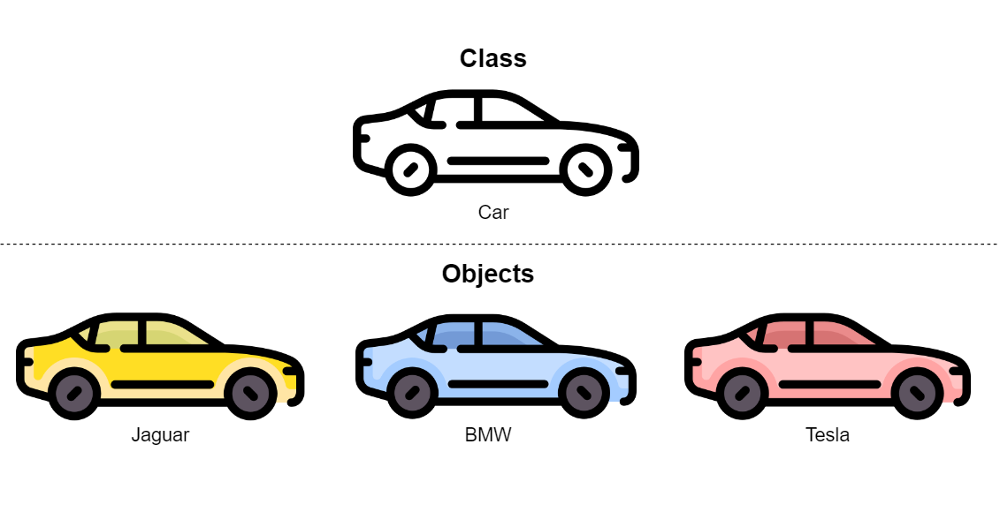

# Introduction to OOP

---

## What is OOP?

- **Programming paradigm** based on **objects**
- **Object** interconnects data and behavior together:
    - **Behavior** is described by procedures and functions, both called methods
    - **Data** is stored in object's member variable (field)
- Often compared with functional programming (FP)
- First appearance at MIT in 1950-1960

---

## Class vs Object

**Class**
- **Template** (blueprint) for object creation
- Abstraction of entity from the real world
- Logical entity

**Object**
- **Instance of some class**
- A concrete entity from the real world
- Physical entity

---

<a href="https://www.flaticon.com/free-icons/car" title="car icons">Car icons created by Freepik - Flaticon</a>

---

## Pillars of OOP

- Abstraction
- Encapsulation
- Inheritance
- Polymorphism

---

### Abstraction

- Two meanings:
    - **Object is only a blackbox with some state and API**
        - We don't need to know internal details about the object to use it
    - **Object is an abstraction of a real-world entity**
        - It's a model which represents all details relevant to given context

---

### Encapsulation

- **Ability of an object to hide parts of its state and behaviors from other objects**
- Related to abstraction - object is a **blackbox**
- Improves modularity
- At the code level it is achieved using _access modifiers_

---

### Inheritance

- **Ability to build new classes on top of existing ones**
- Allows us to share functionality and data
- _SubClass_ vs _SuperClass_
- A frequent stumbling-block
    - Types of relationships:
        - **is** - dog _is_ an animal
        - **has** - dog _has_ a leg
    - _Composition over inheritance_

---

### Polymorphism

- **Ability to access objects of different types through the same interface**
- Ability of an object to “pretend” to be something else
- Related to inheritance
- Types:
    - **Ad hoc polymorphism** - function overloading
    - **Parametric polymorphism** - generics in OOP
    - **Subtyping**

---

## Pros and Cons of OOP

**Pros**:
- Structured code and productivity
- Analogy with real world
- Logical conhesion
- Code maintainability
- Black box

**Cons**:
- Wrong design leads to huge complexity, high coupling and low cohesion
- Black box

---

# OOP in C#

---

## Class

TODO

---

## Thank you for your attention :)

---

## Resources