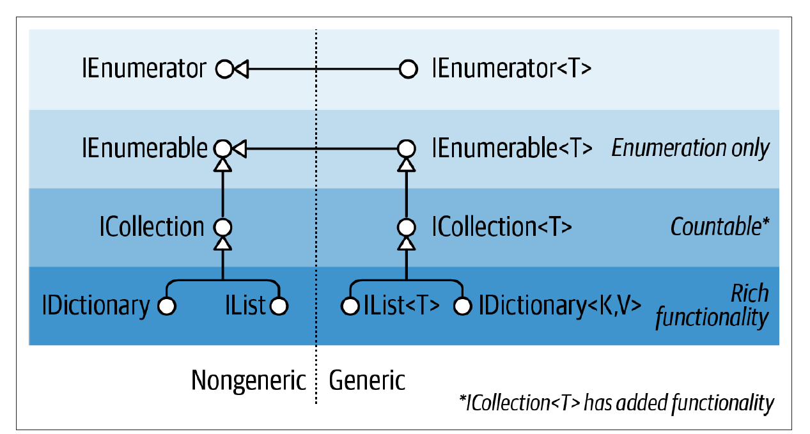
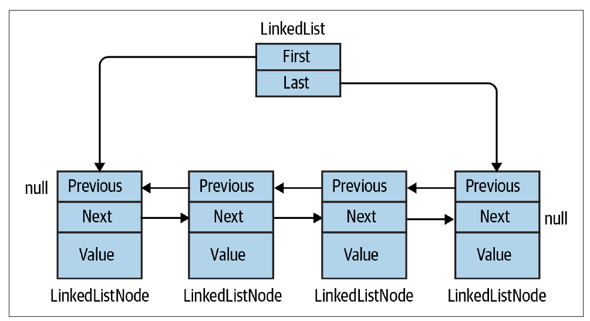
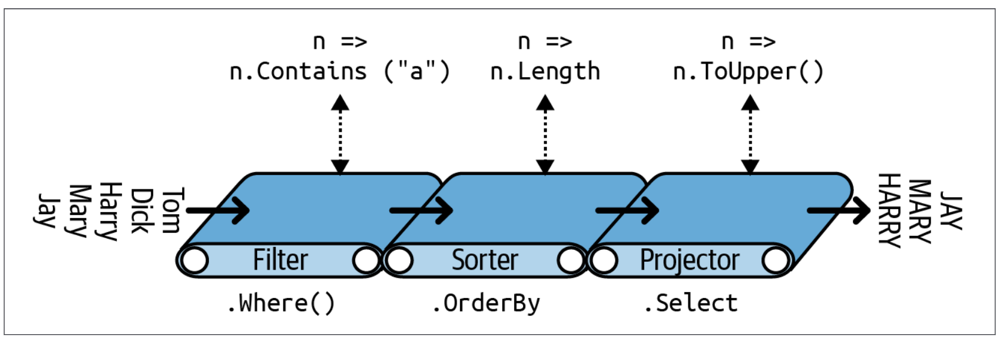

<style>
img[alt~="center"] {
  display: block;
  margin: 0 auto;
}
</style>

# C# and .NET part 4

<div class="lectors">
    <hr/>
    Patrik Švikruha
    <br/>
    Samuel Janek
</div>

---

## Collections

- There are two ways how to group objects:
	- **Arrays** - part of C# language
	- **Collections** - ordinary classes
		- Generic
            - Type-safe at compile time
            - Better performance
		- Non-generic
            - Legacy support
            - **DO NOT USE THEM**
- `System.Collections` namespace

---

### Important interfaces



Image from [C# in Nutshell](https://www.albahari.com/nutshell/) page 334

---

### Enumeration and iterators

- Enumeration = **froward-only** traversal through the collection
- Realized using
	- `IEnumerator` and `IEnumerable` - non-generic version
	- `IEnumerator<T>` and `IEnumerable<T>` - generic version

---

#### `IEnumerator<T>`

- Defines a protocol by which elements in a collection can be
	traversed in **forward-only** manner
- `IDisposable` ensures that _enumerator_ is disposed after enumeration

	```csharp
	public interface IEnumerator
    {
        bool MoveNext();
        object Current { get; }
        void Reset();
    }

	public interface IEnumerator<out T> : IEnumerator, IDisposable
    {
        new T Current { get; }
    }
	```

---

#### `IEnumerable<T>`

- Collection which implements this interface can be
    traversed in **forward-only** manner
- Automatically implemented by **arrays**
- "_IEnumerator provider_"

	```csharp
	public interface IEnumerable
    {
        IEnumerator GetEnumerator();
    }

	public interface IEnumerable<out T> : IEnumerable
    {
        new IEnumerator<T> GetEnumerator();
    }
	```

---

#### `foreach` statement and enumerators

`foreach` statement is a consumer of an _enumerator_

<div class="col2">
<div>

**Syntactic sugar**

```csharp
string beer = "beer";
foreach (var c in beer)
{
	Console.Write(c);
}
```

</div>
<div>

**Lowered code**

```csharp
string beer = "beer";
using (var e = "beer".GetEnumerator())
{
	while (e.MoveNext())
	{
		var c = e.Current;
		Console.Write(c);
	}
}
```

</div>
</div>

---

#### Iterators

- Realized using `yield` statement
- An **iterator method** defines how to generate the objects in a sequence

    ```csharp
    static IEnumerable<int> GenerateNumbers()
    {
        yield return 1;
        yield return 2;
        yield return 3;
    }

    foreach (var number in GenerateNumbers())
    {
        Console.Write(number);
    }
    // Output: 123
    ```

---

#### Iterators

- Producer of an _enumerator_
- Alternative to implementing `IEnumerable<T>` interface by yourself
- An iterator methods must return one of the following:
    - `IEnumerable` or `IEnumerable<T>`
    - `Enumerator` or  `IEnumerator<T>`
- `yield return` cannot appear in `try`, `catch` or `finally` blocks
- `yield break` signals the end of iteration

---

#### `IEnumerable<T>` remarks

- The base interface for collections in the `System.Collections.Generic` namespace
- It **doesn't** provide mechanism to:
    - Determine the size of the collection
    - Access member by index
    - Modify the collection
    - Search in the collection

---

### `ICollection<T>`

```csharp
public interface ICollection<T> : IEnumerable<T>
{
    int Count { get; }
    bool IsReadOnly { get; }
    void Add(T item);
    void Clear();
    bool Contains(T item);
    void CopyTo(T[] array, int arrayIndex);
    bool Remove(T item);
}
```

---

#### `ICollection<T>` remarks

- Extends `IEnumerable<T>` interface
- Standard interface for **countable collections** of objects.
- The base interface for classes in the `System.Collections.Generic` namespace
- Read-only version is `IReadOnlyCollection<T>`

---

### `IList<T>`

```csharp
public interface IList<T> : ICollection<T>
{
    T this[int index] { get; set; }
    int IndexOf(T item);
    void Insert(int index, T item);
    void RemoveAt(int index);
}
```

---

#### `IList<T>` remarks

- Extends `ICollection<T>` interface
- Represents a collection of objects that can be individually **accessed by index**
- Arrays implement both `IList` and `IList<T>`
- Read-only version is `IReadOnlyList<T>`

---

### `IDictionary<TKey, TValue>`

```csharp
public interface IDictionary<TKey, TValue> : ICollection<KeyValuePair<TKey, TValue>>
{
    TValue this[TKey key] { get; set; }
    ICollection<TKey> Keys { get; }
    ICollection<TValue> Values { get; }
    bool ContainsKey(TKey key);
    void Add(TKey key, TValue value);
    bool Remove(TKey key);
    bool TryGetValue(TKey key, [MaybeNullWhen(false)] out TValue value);
}
```

---

#### `IDictionary<TKey, TValue>` remarks

- Extends `ICollection<T>` interface
- Defines the standard protocol for all key/value-based collections
- Keys can be any **non-null** object
- Values can be any object
- **Duplicate keys are forbidden**
- Read-only version is `IReadOnlyDictionary<TKey, TValue>`

---

## Collection types

- `Array`
- `List<T>`
- `LinkedList<T>`
- `Queue<T>`
- `Stack<T>`
- `HashSet<T>`
- `Dictionary<TKey, TValue>`

---

### `Array`

- Implements `ICollection`, `IEnumerable`, `IList`
- Implicit base class for all types of arrays in C#
- Fixed length, contiguous space in memory

---

TODO - sample

---

### `List<T>`

- Implements `ICollection<T>`, `IEnumerable<T>`, `IList<T>`
- Represents a **strongly typed** list of objects that **can be accessed by index**
- Internally implemented using an **array whose size is dynamically increased as required**
- Accepts `null` as a valid value for reference types and allows duplicate elements

---

TODO - sample

---

### `LinkedList<T>`

- Implements `ICollection<T>`, `IEnumerable<T>`
- **Does not** implement `IList<T>` => **access by index is not supported**
- Generic **doubly linked** list
- Nodes are of type `LinkedListNode<T>`
- Accepts `null` as a valid value for reference types and allows duplicate values

---

TODO - sample

---



Image from [C# in Nutshell](https://www.albahari.com/nutshell/) page 366

---

### `Queue<T>`

- Implements `IEnumerable<T>`
- **Does not** implement `IList<T>` => **access by index is not supported**
- FIFO (first-in-first-out) data structure
- Internally implemented using an **array whose size is dynamically increased as required**
- Accepts `null` as a valid value for reference types and allows duplicate elements
- Basic operations:
    - `Enqueue` - adds an element to the end 
    - `Dequeue` - removes the oldest element from the start
    - `Peek` - returns the oldest element that is at the start but does not remove it

---

TODO - sample

---

### `Stack<T>`

- Implements `IEnumerable<T>`
- **Does not** implement `IList<T>` => **access by index is not supported**
- LIFO (last-in-first-out) data structure
- Internally implemented using an **array whose size is dynamically increased as required**
- Accepts `null` as a valid value for reference types and allows duplicate elements
- Basic operations:
    - `Push` - inserts an element at the top
    - `Pop` - removes an element from the top
    - `Peek` - returns an element that is at the top but does not remove it

---

TODO - sample

---

### `HashSet<T>`

- Implements `ICollection<T>`, `IEnumerable<T>`
- Represents a set of values
- Provides high-performance set operations
- **No duplicate elements**
- Internally implemented using **hash table**
- Supports mathematical set operations such as _union_, _intersection_, _subtraction_

---

TODO - sample

---

### `Dictionary<TKey, TValue>`

- Implements `ICollection<T>`, `IEnumerable<T>` where `T` is `KeyValuePair<TKey,TValue>`
- Represents a **collection of keys and values**
- Internally implemented using **hash table**
- A key cannot be `null`
- `Add` method throws an exception when attempting to add a **duplicate key**
- `KeyNotFoundException` is thrown when a requested key is not present

---

TODO - sample

---

## LINQ

- **Language Integrated Query**
- Defined in `System.Linq` namespace
- Set of langauge and runtime features for writing **structured type-safe queries**
- Usable with any collection implementing `IEnumerable<T>` or `IQueryable<T>`
- Extensive use of generics, delegates and extension methods
- Inspired by functional programming
- Different types:
    - LINQ to SQL
    - LINQ to XML
    - LINQ to Objects

---

### Motivation - sum of all items

**Custom method**

```csharp
TODO
```

---

### Motivation - sum of all items

**Using LINQ**

```csharp
TODO
```

---

### Query expression

- Specifies what operations should be applied to data source
- Composed of **query operators**
- Only stores the query commands (not the result)
- LINQ queries are compiled:
    - `IQueryable<T>` => **expression trees**
    - `IEnumerable<T>` => **delegates**

---

### Fluent vs Query syntax

<div class="col2">
<div>

**Fluent syntax**

```csharp
string[] names = { "Dick", "Harry", "Jay" };

IEnumerable<string> query = names
    .Where(n => n.Contains("a"))
    .OrderBy(n => n.Length)
    .Select(n => n.ToUpper());

foreach (string name in query)
    Console.WriteLine(name);

// Output: JAY, HARRY
```

</div>
<div>

**Query syntax**

```csharp
string[] names = { "Dick", "Harry", "Jay" };

IEnumerable<string> query =
    from n in names
    where n.Contains("a")
    orderby n.Length
    select n.ToUpper();

foreach (string name in query)
    Console.WriteLine(name);

// Output: JAY, HARRY
```

</div>
</div>

---



Image from [C# in Nutshell](https://www.albahari.com/nutshell/) page 399

---

### Deferred vs Immediate execution

- **Execution of the query is deferred** until you iterate over the query variable
- `ToList` or `ToArray` methods force immediate execution of the query
- Some queries are by default executed immediately (`Count`, `Max`, `Average`, `First`)

    ```csharp
    string[] names = { "Dick", "Harry", "Jay" };
            
    IEnumerable<string> query = names.Where(n => n.Contains("a"));
    // query: instance of Enumerable.WhereArrayIterator<string>

    var count = names.Max(n => n.Length);
    // count: 5

    var queryResult = query.ToList();
    // queryResult: { "Harry", "Jay" }
    ```

---

### Reevalution

- **Deferred execution query is reevaluated when you reenumerate it**
- Some queries can be computationally intensine => it is better to save a copy of the result (evaluation) using `ToList` or `ToArray` methods

    ```csharp
    string[] names = { "Dick", "Harry", "Jay" };

    IEnumerable<string> query = names.Select(n => n.ToUpper());

    // 1. evaluation
    foreach (var name in query) Console.WriteLine(name);
    
    // 2. evaluation
    foreach (var name in query) Console.WriteLine(name);

    var evaluationResult = query.ToList();
    ```

---

### Query operators

- Defined as **extension methods** of the type that they operate on
- **Never alter the input sequence** (they return a new sequence)
- The standard query operators differ in the timing of their execution
- Not each of them is applicable using query expression syntax
- [50+ operators](https://learn.microsoft.com/en-us/dotnet/csharp/programming-guide/concepts/linq/classification-of-standard-query-operators-by-manner-of-execution#classification-table) 🚀

---

#### Standard operators - `Where`

- Filters a sequence of values based on a predicate
- Deffered execution

    ```csharp
    int[] numbers = new[] { 0, 1, 2, 3, 4 };
            
    var query = numbers.Where(n => n > 5);

    foreach (var number in query)
    {
        Console.WriteLine(number);
    }
    // Output: { 6, 7, 8, 9 }
    ```

---

#### Standard operators - `Select`

- Projects each element of a sequence into a new form
- Deffered execution

    ```csharp
    int[] numbers = new[] { 5, 6, 7, 8 };
            
    var query = numbers.Select((number, index) => number * index);

    foreach (var number in query)
    {
        Console.WriteLine(number);
    }
    // Output: { 0, 6, 14, 24 }
    ```

---

#### Standard operators - `Any`

- Determines whether any element of a sequence exists or satisfies a condition
- **Immediate execution**

    ```csharp
    int[] numbers = new[] { 1, 2, 3, 4, 5 };
            
    var res1 = numbers.Any();
    var res2 = numbers.Any(n => n > 10);

    Console.WriteLine(res1);    // True
    Console.WriteLine(res2);    // False
    ```

---

#### Standard operators - `Contains`

- Determines whether a sequence contains a specified element by using the default equality comparer
- **Immediate execution**

    ```csharp
    int[] numbers = new[] { 1, 2, 3, 4, 5 };

    var res1 = numbers.Contains(3);
    var res2 = numbers.Contains(10);

    Console.WriteLine(res1);    // True
    Console.WriteLine(res2);    // False
    ```

---

#### Standard operators - `ElementAt`

- Returns the element at a specified index in a sequence
- **Immediate execution**

    ```csharp
    int[] numbers = new[] { 1, 2, 3, 4, 5 };

    var elem1 = numbers.ElementAt(3);

    Console.WriteLine(elem1);           // 4

    var elem2 = numbers.ElementAt(10);  // ArgumentOutOfRangeException
    ```

---

#### Standard operators - `First` and `FirstOrDefault`

- `First` - returns the first element of a sequence
- `FirstOrDefault` - returns the first element of the sequence that satisfies a condition, or a specified default value if no such element is found
- **Immediate execution**

    ```csharp
    int[] numbers = new[] { 1, 2, 3, 4, 5 };

    var n1 = numbers.First();                        // 1
    var n2 = numbers.First(n => n > 3);              // 4
    var n3 = numbers.FirstOrDefault();               // 1
    var n4 = numbers.FirstOrDefault(n => n > 10);    // 0
    ```

---

#### Standard operators - `Single` and `SingleOrDefault`

- `Single` - returns the only element of a sequence that satisfies a specified condition, and throws an exception if more than one such element exists
- `SingleOrDefault` - returns the only element of a sequence, or a default value if the sequence is empty or throws an exception if more than one such element exists
- **Immediate execution**

    ```csharp
    int[] numbers = new[] { 1, 2, 3, 4, 5 };

    var n1 = numbers.Single(n => n == 2);               // 2
    var n2 = numbers.SingleOrDefault(n => n == 10);     // 0 - default value
    var n3 = numbers.SingleOrDefault(n => n > 1);       // Exception 
    ```

---

#### Standard operators - `GroupBy`

- Groups the elements of a sequence according to a specified key selector function and creates a result value from each group and its key
- Deffered execution

    ```csharp
    record Person(string Name, uint Age);

    Person[] persons = new Person[]
        { new("John", 40), new("Adam", 22), new("Mike", 22), new("Carl", 52) };

    var grouped = persons.GroupBy(p => p.Age);
    foreach (var group in grouped)
        Console.WriteLine(group);

    // { Key: 40, [ { Name: "John", Age: 40 } ]}
    // { Key: 22, [ { Name: "Adam", Age: 22 }, { Name: "Mike", Age: 22 } ]}
    // { Key: 50, [ { Name: "Carl", Age: 50 } ]}
    ```

---

#### Standard operators - `Join`

- Correlates the elements of two sequences based on matching keys
- The default equality comparer is used to compare keys

```csharp
TODO
```

---

#### Standard operators - `OrderBy`

- Sorts the elements of a sequence in ascending order according to a key

```csharp
TODO
```

---

#### Standard operators - `Skip` and `SkipWhile`

- Bypasses a specified number of elements in a sequence and then returns the remaining elements

```csharp
TODO
```

---

#### Standard operators - `Take` and `TakeWhile`

```csharp
TODO
```

---

#### Standard operators - `Range`

- Generates a sequence of integral numbers within a specified range

```csharp
TODO
```

---

#### Standard operators - `Aggregate`

- Applies an accumulator function over a sequence
- The specified seed value is used as the initial accumulator value

```csharp
TODO
```

---

## Concurrency and Asynchrony

---

### Motivation

- Most applications need to deal with more than one thing happening at a time
- Common concurrency scenarios:
    - Writing responsive UI
    - Allowing requests to process simultaneously
    - Parallel programming

---

### Possible approaches

- Working with threads
- Using tasks
- Asynchronous programming

---

TODO

---

WORK IN PROGRESS

LINQ

- AsXXX robi iba casting
- ToXXX alokuje novu kolekciu

---

## Thank you for your attention :)

---

### Iterators under the hood

- Compiler converts iterator method into private class that implements `IEnumerable<T>` and `IEnumerator<T>`
- Iterator method then returns instance of a compiler written class which has a `GetEnumerator()` method which returns enumerator
- `foreach` statement which consumes your iterator method is rewritten to `while` loop which uses enumerator to travers the collection
- For more details, you can examine lowered code on [sharplab.io](https://sharplab.io/)

---

## Resources

- [C# in Nutshell](https://www.amazon.com/gp/product/1098121953?ie=UTF8&tag=cinanu-20&linkCode=as2&camp=1789&creative=9325&creativeASIN=1098121953)
- [VUT FIT ICS slides](https://github.com/nesfit/ICS/tree/master/Lectures)